<!--
  Perfil de GitHub de David Ruiz (@viajatech) — diseño "OBSIDIAN FORGE × Isabella".
  Los SVG de assets/ se GENERAN con tools/build_assets.py (no editarlos a mano). Guía: tools/README.md
-->

  

  &nbsp;&nbsp;
  

<b>Isabella is my AI.</b> She knows my work, speaks your language and answers in real time — by text or by voice. Go ahead: ask her anything about me.

 

**I build AI agents that ship.** I'm David Ruiz, a creative technologist and AI architect based in Mexico City. I design autonomous agents and multi-agent systems — and then I put them to work in real products: live websites, a store that takes real payments, books, and a voice AI with a soul.

Years of directing hotels left me one rule I apply to everything I build: **a tool should feel like a perfect check-in.** It anticipates, it never gets in your way, and it lets you keep moving.

 

<picture>
  <source media="(prefers-color-scheme: dark)" srcset="assets/sec-ship-dark.svg">
  
</picture>

| Craft | What it means |
|:--|:--|
| **AI agents & multi-agent systems** | Autonomous agents wired into my terminal and my daily workflows. They plan, use tools and coordinate other agents — a whole crew, run by one operator. |
| **Voice & conversational AI** | **Isabella** — real-time voice (Gemini Live) and text chat, with a locked persona, multi-provider fallback and anti-abuse built in. Live on [jettrendy.com](https://jettrendy.com). |
| **Products that run** | [jettrendy.com](https://jettrendy.com) on Next.js + Vercel, and [viajatech.xyz](https://viajatech.xyz) — a digital store on Cloudflare Workers that sells for real with Stripe. |
| **Books** | Books in English and Spanish, from applied agentic AI to the gut microbiome — on Amazon Kindle and in my own store. |
| **Content & campaigns** | 100K+ followers across platforms, campaigns that reached millions, and editorial video editing for brands. |
| **Hospitality DNA** | International hotel management — operations, revenue, and an obsession with how things *feel*. |

 

<picture>
  <source media="(prefers-color-scheme: dark)" srcset="assets/sec-live-dark.svg">
  
</picture>

| Live | What it is |
|:--|:--|
| [**jettrendy.com**](https://jettrendy.com) | My portfolio and Isabella's home — text chat on the home page, voice on [/about](https://jettrendy.com/about). Next.js 16 · React 19 · Vercel · Gemini Live |
| [**viajatech.xyz**](https://viajatech.xyz) | A digital store that sells for real: books, software and courses, with Stripe checkout and instant delivery. Cloudflare Workers · Hono · D1 · Stripe |
| [**The books**](https://viajatech.xyz/ebooks) | My catalog in English and Spanish — also on Amazon Kindle. Written, designed and shipped end to end |
| [**YouTube**](https://www.youtube.com/@viajatech) @viajatech | AI agents, local LLMs and vibe coding, in short form. |

 

<picture>
  <source media="(prefers-color-scheme: dark)" srcset="assets/sec-stack-dark.svg">
  
</picture>

| Layer | Tools |
|:--|:--|
| **AI** | Claude · GPT · Gemini & Gemini Live · GLM · DeepSeek · OpenRouter · local models (LM Studio) · multi-agent orchestration |
| **Web** | TypeScript · Next.js · React · Tailwind · Hono · three.js · WebGL |
| **Infra & data** | Vercel · Cloudflare Workers · D1 · Upstash Redis · Stripe · Resend |
| **Automation & media** | Python · Playwright · FFmpeg · Replicate · Office automation |

 

<picture>
  <source media="(prefers-color-scheme: dark)" srcset="assets/sec-repos-dark.svg">
  
</picture>

| Repo | What it does |
|:--|:--|
| [**TRON&nbsp;ARES**](https://github.com/viajatech/ARES) | An "armor" for AI: gives a model reasoning, control of Word and Excel, web navigation and media downloads. |
| [**Super&nbsp;Agente**](https://github.com/viajatech/SuperAgente) | An autonomous AI agent that reasons, remembers and drives desktop apps and web services. |
| [**Hotelero&nbsp;Plus**](https://github.com/viajatech/HoteleroPlus) | A desktop suite for hotel operations — where my two worlds, hospitality and software, meet. |

 

<picture>
  <source media="(prefers-color-scheme: dark)" srcset="assets/sec-books-dark.svg">
  
</picture>

> *David Ruiz divides his time between Mexico City and whatever he has decided to understand that season. Every one of his books began as a private obsession. He publishes them when they stop being one.*

**[Browse the books →](https://viajatech.xyz/ebooks)**

 

<b>🇲🇽 Léelo en español</b>

 

**Construyo agentes de IA que se entregan funcionando.** Soy David Ruiz, creative technologist y arquitecto de IA en la Ciudad de México. Diseño agentes autónomos y sistemas multiagente, y los pongo a trabajar en productos reales: sitios vivos, una tienda que cobra de verdad, libros y una IA de voz con alma.

> una sola persona. un ejército de IAs. cero límites. 
> sitios vivos. tiendas que cobran. libros. voces con alma. 
> el futuro no se promete: se entrega funcionando.

**Habla con Isabella**, mi IA: por texto en [jettrendy.com](https://jettrendy.com) o por voz en [jettrendy.com/about](https://jettrendy.com/about). Conoce mi trabajo y te responde en tu idioma.

Mi tienda: [viajatech.xyz](https://viajatech.xyz) · Mis libros: [viajatech.xyz/ebooks](https://viajatech.xyz/ebooks) · YouTube: [@viajatech](https://www.youtube.com/@viajatech)

 

<picture>
  <source media="(prefers-color-scheme: dark)" srcset="assets/sec-connect-dark.svg">
  
</picture>

  
  
  

  
  
  
  
  
  

 

<picture>
  <source media="(prefers-color-scheme: dark)" srcset="assets/footer-dark.svg">
  
</picture>
